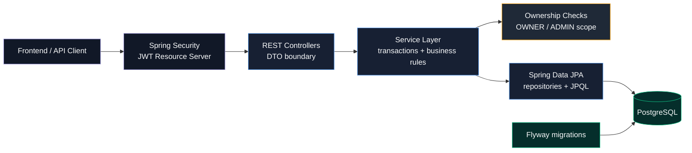
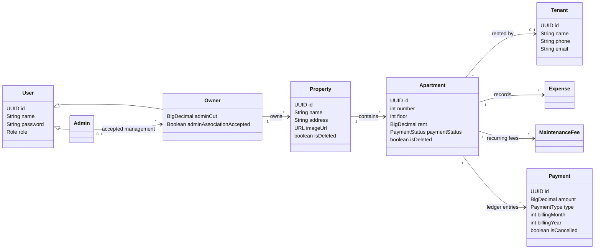
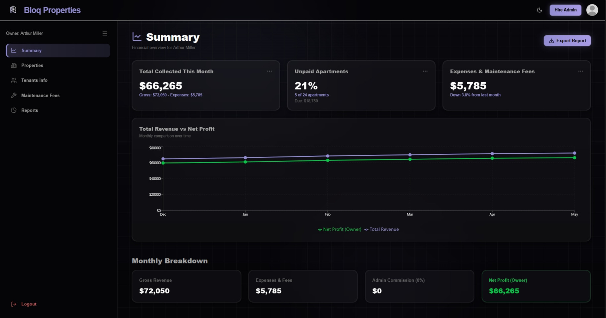
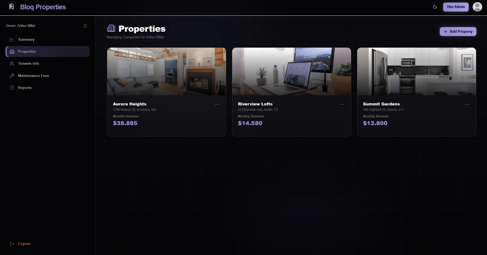
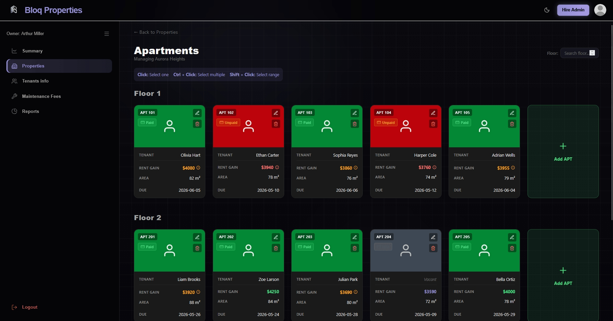
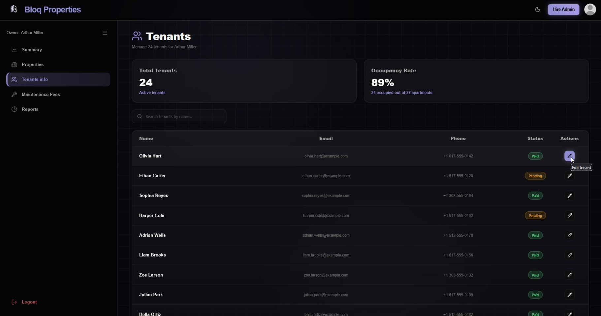
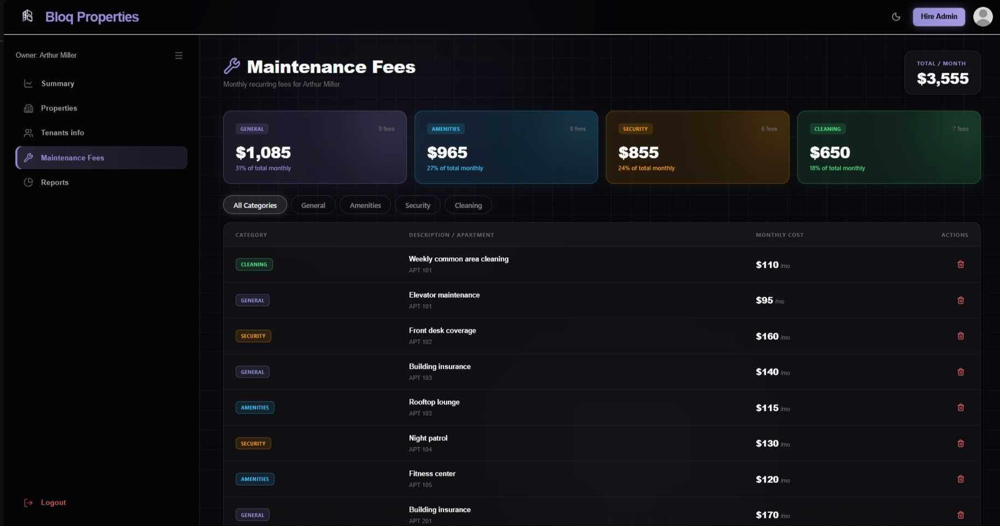
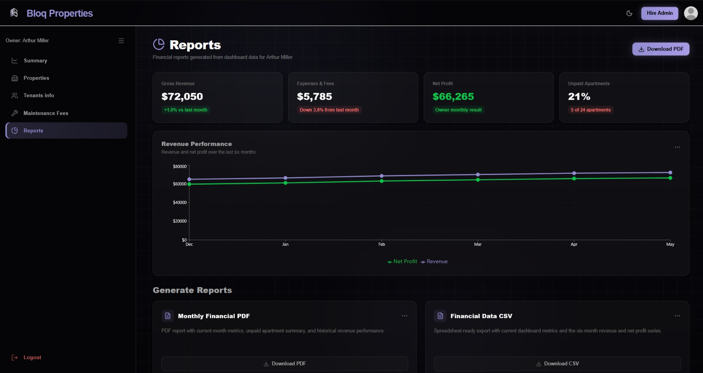

<p align="right">
  <strong>🇦🇷 Español</strong> | <a href="README.md">🇺🇸 English</a>
</p>

# Property Management Back Office API

<div align="center">


**Backend Spring Boot para propietarios y administradores de alquileres.**

</div>

---

## Resumen

Property Management Back Office API es un caso de estudio backend para gestionar propiedades, departamentos, inquilinos, pagos, gastos y acceso delegado de administradores.

El proyecto empezó como trabajo universitario y se presenta como muestra backend, no como SaaS en producción. El foco está en fundamentos: modelado relacional, autenticación, autorización por alcance, reglas transaccionales, migraciones de base de datos, Docker, CI y tests.

---

## Highlights

- API REST Spring Boot por capas: controllers, services, repositories, DTOs y entidades JPA
- Autenticación JWT con Spring Security OAuth2 Resource Server
- Refresh token almacenado en cookie `HttpOnly`
- Roles `OWNER` y `ADMIN` con acceso acotado por recurso
- Flujo de asociación owner-admin con aceptación explícita del admin
- Creación de propiedades con generación de departamentos por rangos de piso/número
- Gestión de inquilinos, vacantes, gastos, estado de alquiler y expensas
- Ledger de pagos usado para resúmenes mensuales de ingresos, gastos, comisión y ganancia
- Soft deletes para propiedades y departamentos
- Migraciones Flyway con validación de schema por Hibernate
- Docker Compose con health checks de PostgreSQL
- Pipeline GitHub Actions para build y tests
- 18 tests pasando entre Cucumber, integración y unit tests

---

## Arquitectura



<div align="center">

| Capa | Responsabilidad |
|---|---|
| Controllers | Endpoints REST y mapeo de DTOs |
| Services | Transacciones, reglas de negocio y ownership checks |
| Repositories | Queries con Spring Data JPA |
| Entities | Modelo relacional |
| Config | Security, JWT, CORS, logging y toggles de OpenAPI |

</div>

---

## Dominio

El modelo separa usuarios de recursos de alquiler. `Admin` y `Owner` heredan de `User`; los owners gestionan propiedades; las propiedades contienen departamentos; los departamentos pueden tener inquilinos, gastos, expensas y pagos.



---

## Capturas

### Dashboard de Resumen

<p align="center">
  
  <br/>
  <small><em>Dashboard financiero</em></small>
</p>

### Dashboard de Propiedades

<p align="center">
  
  <br/>
  <small><em>Dashboard de propiedades</em></small>
</p>

### Grilla de Departamentos

<p align="center">
  
  <br/>
  <small><em>Grilla de departamentos agrupada por propiedad y piso</em></small>
</p>

### Tabla de Inquilinos

<p align="center">
  
  <br/>
  <small><em>Tabla de inquilinos</em></small>
</p>

### Expensas

<p align="center">
  
  <br/>
  <small><em>Expensas por categoría y departamento</em></small>
</p>

### Reportes

<p align="center">
  
  <br/>
  <small><em>Reportes y exportación</em></small>
</p>

---

## Decisiones Backend

### Acceso admin basado en consentimiento

Los owners pueden solicitar asociación con un admin y definir su porcentaje de comisión. El admin no puede gestionar al owner inmediatamente: primero debe aceptar la solicitud.

Esa regla se aplica en los services, no solo en el frontend. Los owners solo acceden a sus propios recursos, y los admins solo acceden a owners que los aceptaron.

### Ledger de pagos

El sistema guarda alquileres, gastos y expensas como registros `Payment`. Marcar un departamento como pagado crea los registros del mes actual; marcarlo como impago cancela los registros activos.

Esto hace que el resumen financiero dependa de eventos persistidos y no solo del estado actual del departamento.

### Migraciones Flyway

El schema se versiona con Flyway:

```text
src/main/resources/db/migration/V1__init_schema.sql
```

Hibernate corre con `ddl-auto=validate`, por lo que la aplicación falla si la base no coincide con el modelo de entidades. `baseline-on-migrate=true` permite adoptar una base existente en Render después de introducir Flyway.

### OpenAPI

Springdoc OpenAPI está incluido, pero deshabilitado por defecto en despliegues públicos.

```env
OPENAPI_ENABLED=false
SWAGGER_UI_ENABLED=false
```

OpenAPI es el contrato legible por máquina de la API. Swagger UI es la interfaz web generada desde ese contrato. Para demos locales o privadas, habilitar ambos expone:

```text
/v3/api-docs
/swagger-ui/index.html
```

---

## Seguridad

- Configuración stateless con Spring Security
- Hash de contraseñas mediante Spring Security `PasswordEncoder`
- Access tokens JWT con subject y role claims
- Refresh token almacenado como cookie `HttpOnly`
- CORS configurado desde orígenes explícitos por environment
- Errores genéricos de login para evitar enumeración de usuarios
- Request logging sin payloads para evitar registrar credenciales
- Secretos y credenciales de base cargados desde variables de entorno

---

## Testing

Verificado localmente el 11 de mayo de 2026:

```text
18 tests, 0 failures, 0 errors, 0 skipped
```

Los flujos cubiertos incluyen registro, login, creación de propiedad/departamento, asociación owner-admin, acceso admin denegado antes de aceptar, acceso admin luego de aceptar, generación/cancelación de pagos de expensas y cálculo del resumen mensual.

---

## Stack

| Área | Tecnología |
|---|---|
| Lenguaje | Java 25 |
| Framework | Spring Boot 4.0.5 |
| Seguridad | Spring Security, OAuth2 Resource Server, JWT |
| Persistencia | Spring Data JPA, Hibernate |
| Base de datos | PostgreSQL 17, H2 para tests |
| Migraciones | Flyway |
| Testing | JUnit 5, Cucumber, AssertJ, Mockito |
| Build | Gradle Kotlin DSL |
| Infra | Docker, Docker Compose, Render |
| CI | GitHub Actions |
| API docs | Springdoc OpenAPI, controlado por environment |

---

## Desarrollo Local

Crear `.env` desde `.env.example` y ejecutar:

```powershell
docker compose up --build
```

Backend URL:

```text
http://localhost:8080
```

Ejecutar tests:

```powershell
.\gradlew.bat test
```

---

## Superficie Principal de API

| Área | Endpoints |
|---|---|
| Auth | `/auth/login`, `/auth/refresh`, `/auth/logout`, `/auth/register/admin`, `/auth/register/owner` |
| Admins | `/admins`, `/admins/me/owners`, `/admins/me/owner-requests` |
| Owners | `/owners/me/admin`, `/owners/{ownerId}/summary` |
| Properties | `/properties`, `/properties/{propertyId}`, `/properties/{propertyId}/apartments` |
| Apartments | `/apartments`, `/apartments/single`, `/apartments/bulk`, `/apartments/{apartmentId}` |
| Tenants | `/apartments/{apartmentId}/tenant` |
| Expenses | `/apartments/{apartmentId}/expenses` |
| Maintenance fees | `/apartments/{apartmentId}/maintenance-fees` |

---

## Limitaciones Actuales

Este proyecto no se presenta como SaaS en producción. Las próximas mejoras backend serían:

- Separar secretos de firma para access y refresh tokens
- Expandir validación de DTOs y normalizar respuestas de error
- Agregar rate limiting en endpoints de autenticación
- Agregar tests con Testcontainers PostgreSQL para migraciones y queries específicas de base
- Agregar audit logs estructurados para acciones sensibles de seguridad

---

<div align="center">

[](https://www.linkedin.com/in/camilosassone/)
[](mailto:camilosassone.dev@gmail.com)

</div>
