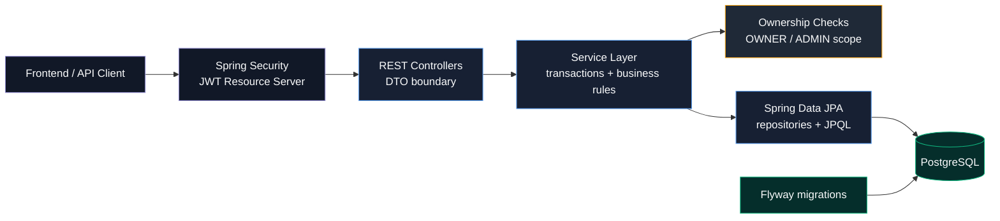
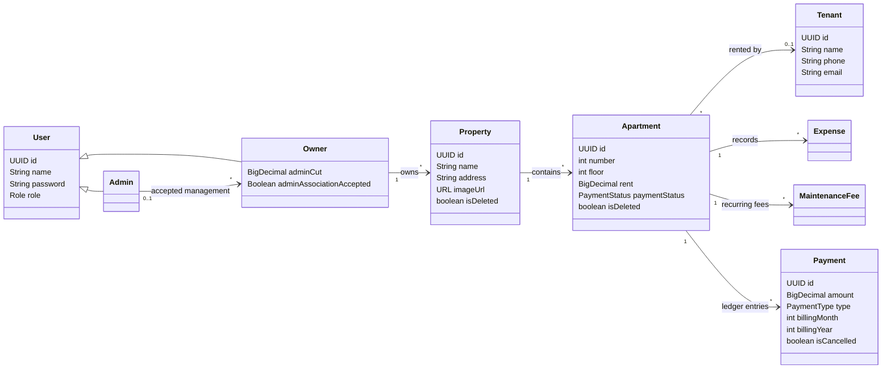

<p align="right">
  <strong>English</strong> | <a href="README.es.md">Español</a>
</p>

# Property Management Back Office API

<div align="center">


**Spring Boot backend for property owners and rental administrators.**

</div>

---

## Overview

Property Management Back Office API is a backend case study for managing rental properties, apartments, tenants, payments, expenses, and delegated administrator access.

The project started as university work and is presented here as a backend showcase, not as a production SaaS. The focus is on fundamentals: relational modeling, authentication, scoped authorization, transactional business rules, database migrations, Docker, CI, tests and, of course, languages and frameworks.

---

## Highlights

- Layered Spring Boot REST API: controllers, services, repositories, DTOs, JPA entities
- JWT authentication with Spring Security OAuth2 Resource Server
- Refresh token stored in an `HttpOnly` cookie
- `OWNER` and `ADMIN` roles with scoped resource access
- Owner-to-admin association flow with explicit admin acceptance
- Property creation with apartment generation from floor/number ranges
- Tenant assignment, vacancy handling, expenses, rent status, and maintenance fees
- Payment ledger used for monthly revenue, expense, commission, and profit summaries
- Soft deletes for properties and apartments
- Flyway migrations with Hibernate schema validation
- Docker Compose with PostgreSQL health checks
- GitHub Actions build/test pipeline
- 18 passing tests across Cucumber, integration, and unit tests

---

## Architecture



| Layer | Responsibility |
|---|---|
| Controllers | REST endpoints and DTO mapping |
| Services | Transactions, business rules, ownership checks |
| Repositories | Spring Data JPA queries |
| Entities | Relational domain model |
| Config | Security, JWT, CORS, logging, OpenAPI toggles |

---

## Domain

The model separates users from rental resources. `Admin` and `Owner` inherit from `User`; owners manage properties; properties contain apartments; apartments can have tenants, expenses, maintenance fees, and payment records.



---

## Screenshots

### Summary Dashboard

<p align="center">
  
  <br/>
  <small><em>Financial summary dashboard</em></small>
</p>

### Properties Dashboard

<p align="center">
  
  <br/>
  <small><em>Properties dashboard</em></small>
</p>

### Apartment Grid

<p align="center">
  
  <br/>
  <small><em>Apartment grid grouped by property and floor</em></small>
</p>

### Tenants Table

<p align="center">
  
  <br/>
  <small><em>Tenants table</em></small>
</p>

### Maintenance Fees

<p align="center">
  
  <br/>
  <small><em>Maintenance fees by category and apartment</em></small>
</p>

### Reports

<p align="center">
  
  <br/>
  <small><em>Reports and export screen</em></small>
</p>

---

## Backend Decisions

### Consent-based admin access

Owners can request association with an admin and define the admin commission percentage. The admin cannot manage the owner immediately: the request must be accepted first.

That rule is enforced in service methods, not only in the frontend. Owners can only access their own resources, and admins can only access owners who accepted them.

### Payment ledger

The system stores rent, expense, and maintenance-fee events as `Payment` records. Marking an apartment as paid creates current-month rent and maintenance-fee records; marking it unpaid cancels the active records.

This makes the summary endpoint depend on persisted financial events instead of recalculating everything from current apartment state.

### Flyway migrations

The schema is versioned with Flyway:

```text
src/main/resources/db/migration/V1__init_schema.sql
```

Hibernate runs with `ddl-auto=validate`, so the app fails if the database schema does not match the entity model. `baseline-on-migrate=true` is enabled so an existing Render database can be adopted safely after introducing Flyway.

### OpenAPI

Springdoc OpenAPI is included but disabled by default on public deployments.

```env
OPENAPI_ENABLED=false
SWAGGER_UI_ENABLED=false
```

OpenAPI is the machine-readable API contract. Swagger UI is the browser interface generated from it. For local/private demos, enabling both exposes:

```text
/v3/api-docs
/swagger-ui/index.html
```

---

## Security

- Stateless Spring Security configuration
- Password hashing through Spring Security `PasswordEncoder`
- JWT access tokens with subject and role claims
- Refresh token stored as an `HttpOnly` cookie
- CORS configured from explicit environment origins
- Generic login errors to avoid username/password probing
- Request logging configured without payloads to avoid credential logging
- Secrets and database credentials loaded from environment variables

---

## Testing

Verified locally on May 11, 2026:

```text
18 tests, 0 failures, 0 errors, 0 skipped
```

Covered flows include registration, login, property/apartment creation, owner-admin association, denied admin access before acceptance, accepted admin access, maintenance-fee payment generation/cancellation, and monthly financial summary calculation.

---

## Stack

| Area | Technology |
|---|---|
| Language | Java 25 |
| Framework | Spring Boot 4.0.5 |
| Security | Spring Security, OAuth2 Resource Server, JWT |
| Persistence | Spring Data JPA, Hibernate |
| Database | PostgreSQL 17, H2 for tests |
| Migrations | Flyway |
| Testing | JUnit 5, Cucumber, AssertJ, Mockito |
| Build | Gradle Kotlin DSL |
| Infra | Docker, Docker Compose, Render |
| CI | GitHub Actions |
| API docs | Springdoc OpenAPI, environment-controlled |

---

## Local Development

Create `.env` from `.env.example`, then run:

```powershell
docker compose up --build
```

Backend URL:

```text
http://localhost:8080
```

Run tests:

```powershell
.\gradlew.bat test
```

---

## Main API Surface

| Area | Endpoints |
|---|---|
| Auth | `/auth/login`, `/auth/refresh`, `/auth/logout`, `/auth/register/admin`, `/auth/register/owner` |
| Admins | `/admins`, `/admins/me/owners`, `/admins/me/owner-requests` |
| Owners | `/owners/me/admin`, `/owners/{ownerId}/summary` |
| Properties | `/properties`, `/properties/{propertyId}`, `/properties/{propertyId}/apartments` |
| Apartments | `/apartments`, `/apartments/single`, `/apartments/bulk`, `/apartments/{apartmentId}` |
| Tenants | `/apartments/{apartmentId}/tenant` |
| Expenses | `/apartments/{apartmentId}/expenses` |
| Maintenance fees | `/apartments/{apartmentId}/maintenance-fees` |

---

## Current Limitations

This is not presented as production SaaS. The next backend improvements would be:

- Split access and refresh token signing secrets
- Expand DTO validation and normalize error responses
- Add rate limiting to authentication endpoints
- Add Testcontainers PostgreSQL tests for migrations and database-specific queries
- Add structured audit logs for security-sensitive actions

---

<div align="center">

[](https://www.linkedin.com/in/camilosassone/)
[](mailto:camilosassone.dev@gmail.com)

</div>
